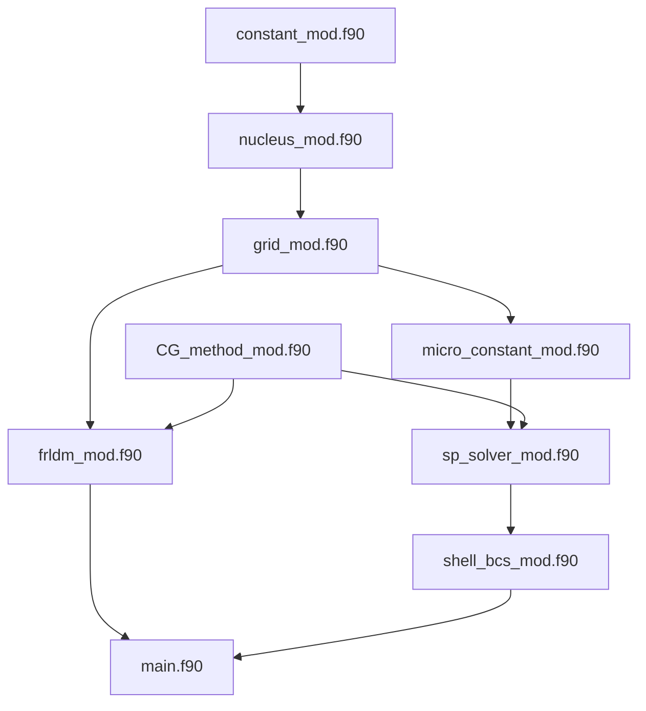

# MACROSCOPIC-MICROSCOPIC法

## 概要

このプロジェクトは、原子核物理学におけるFRLDM+Shell+BCSを解くためのプログラム群です．

## 参考文献

[Macro-Micro Frame Work](https://www.sciencedirect.com/science/article/pii/S0092640X1600005X) 
[Axial Asymmetry](https://iopscience.iop.org/article/10.1088/0031-8949/8/1-2/003)  
[Shell+Pairing](https://journals.aps.org/prc/abstract/10.1103/PhysRevC.5.1050)  
[Pairing](https://www.sciencedirect.com/science/article/pii/037594749290244E)  
[Shell1](https://www.sciencedirect.com/science/article/pii/0375947468906994)  
[Shell2](https://www.sciencedirect.com/science/article/pii/0375947467905106)
[Nilsson Oscillator](file:///C:/Users/daich/Desktop/%E8%AB%96%E6%96%87%E5%80%89%E5%BA%AB/MICROSCOPIC-METHOD/ON_THE_NUCLEAR_STRUCTURE_AND_STABILITY_OF_HEAVY_AND_SUPERHEAVY_ELEMENT.pdf)

## 各ファイルの依存関係

                
## 運用

1. [プロジェクトのフォークを作成]
2. [変更を加える]
3. [プルリクエストを送信]

## 更新履歴

* 2026/4/21: [README.md を作成]
* 2026/5/14: [依存関係を明記]
