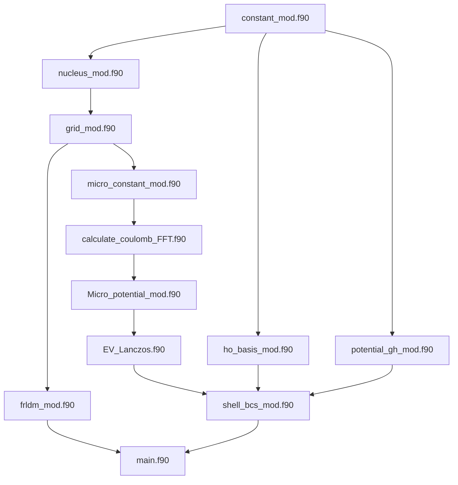

# MACROSCOPIC-MICROSCOPIC法

## 概要

このプロジェクトは、原子核物理学におけるFRLDM+Shell+BCSを解くためのプログラム群です．

## 参考文献

[Macro-Micro Frame Work](https://www.sciencedirect.com/science/article/pii/S0092640X1600005X)  
[Axial Asymmetry](https://iopscience.iop.org/article/10.1088/0031-8949/8/1-2/003)  
[Shell+Pairing](https://journals.aps.org/prc/abstract/10.1103/PhysRevC.5.1050)  
[Pairing](https://www.sciencedirect.com/science/article/pii/037594749290244E)  
[Shell1](https://www.sciencedirect.com/science/article/pii/0375947468906994)  
[Shell2](https://www.sciencedirect.com/science/article/pii/0375947467905106)  
[Nilsson Oscillator](https://www.sciencedirect.com/science/article/pii/0375947469908094)


## 各ファイルの依存関係
→の後にあるファイルはその前にあるすべてのファイルを参照していることに注意してください．なお，すべてのファイルは./fundamental内のファイルのmoduldeを適宜参照しています．


```mermaid
graph TD;
    constant_mod.f90-->nucleus_mod.f90;
    nucleus_mod.f90-->grid_mod.f90;
    grid_mod.f90-->frldm_mod.f90;
    grid_mod.f90-->micro_constant_mod.f90;
    micro_constant_mod.f90-->calculate_coulomb_FFT.f90
    calculate_coulomb_FFT.f90-->Micro_potential_mod.f90
    Micro_potential_mod.f90-->EV_Lanczos.f90
    EV_Lanczos.f90-->shell_bcs_mod.f90
    frldm_mod.f90-->main.f90
    shell_bcs_mod.f90-->main.f90
    constant_mod.f90-->ho_basis_mod.f90
    ho_basis_mod.f90-->shell_bcs_mod.f90
    constant_mod.f90-->potential_gh_mod.f90
    potential_gh_mod.f90-->shell_bcs_mod.f90

```
                
## 三軸変形調和振動子基底 (ho_basis_mod.f90)

三軸変形核の一粒子準位を変形調和振動子基底の行列対角化で求めるモジュールです．ポテンシャル・∇V₁はGauss–Hermite求積点 `basis%point(axis,i)` 上で与えます．LAPACK (dstev, zheev) が必要です．

```bash
gfortran -O2 -fopenmp constant_mod.f90 ho_basis_mod.f90 test_ho_basis.f90 -llapack -o test_ho_basis.exe
./test_ho_basis.exe
```

## 求積点上のポテンシャル (potential_gh_mod.f90)

折りたたみ湯川ポテンシャル V₁，その勾配 ∇V₁，クーロンポテンシャル V_C を，生成形状の表面積分で任意の点（Gauss–Hermite求積点など）上に計算するモジュールです（FRDM2012 式(81),(91)）．ポアソン方程式を解かないので，無限遠の境界条件は厳密に満たされます．

- `Y = V₁/(-V₀)`，`∇Y`，`C = V_C/(e²ρ_c)` を返します．`V₁ = -V₀ Y`，`V_C = e²ρ_c C`（ρ_c = Z/(4πR_pot³/3)）です．
- 形状は `surface_shape` を拡張して追加します．今は三軸楕円体 `ellipsoid_shape` と，(ε, γ) から作る `ellipsoid_from_eps_gamma` があります．
- 表面近くの点は，表面パネルを適応的に分割して計算します．∇Y の 1/s 特異性は恒等式で取り除いてあります．
- `on_grid(..., d2h=.true.)` で鏡映対称性を使い，1/8 の点だけを計算します．

```bash
gfortran -O2 -fopenmp constant_mod.f90 ho_basis_mod.f90 potential_gh_mod.f90 test_potential_gh.f90 -llapack -o test_potential_gh.exe
./test_potential_gh.exe
```

既知の制限：∇V₁ は表面で折れ曲がる（2階微分が不連続な）ため，スピン軌道項の行列要素の Gauss–Hermite 求積の収束が遅く，球形核でも (2j+1) 重縮退が数十 keV ほど分裂します（²⁰⁸Pb で最大 0.04 MeV）．部分積分で ∇V₁ の代わりに V₁ を使う形にすると改善できる見込みです．

## 運用

1. [プロジェクトのフォークを作成]
2. [変更を加える]
3. [プルリクエストを送信]


## 更新履歴

* 2026/4/21: [README.md を作成]
* 2026/5/14: [依存関係を明記]
